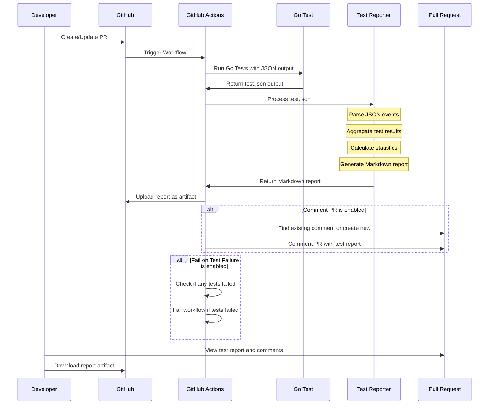

# Go Test Report Generator

A command-line tool and GitHub Action that generates beautiful Markdown reports from Go test output in JSON format.

## Features

- Transforms Go test JSON output into readable Markdown reports
- Provides summary statistics:
  - Total, passed, failed, and skipped test counts
  - Success rate percentage
  - Total test duration
- Visual status indicators:
  - Status badges (PASSED/FAILED/SKIPPED)
  - Emoji indicators for test results (✅ PASS, ❌ FAIL, ⏭️ SKIP)
- Detailed test results:
  - Hierarchical display of tests and subtests
  - Test durations with visual bar charts for the longest tests
  - Detailed failure information for debugging
- CI/CD integration:
  - GitHub Actions workflow included
  - Can be used as a GitHub Action or standalone CLI tool

## Sequence Diagram


## Usage

### As a GitHub Action

Add the following to your workflow file:

```yml
- name: Run Go tests with JSON output
  run: go test ./... -json > test-output.json || true

- name: Generate Test Report
  uses: dipjyotimetia/gotest-report@v1
  with:
    test-json-file: test-output.json
    output-file: test-report.md
    comment-pr: true
    fail-on-test-failure: false
```

### Action Inputs

| Input | Description | Required | Default |
| ----- | ----------- | -------- | ------- |
| test-json-file | Path to the go test -json output file | No | test-output.json |
| output-file | Path for the generated Markdown report | No | test-report.md |
| comment-pr | Whether to comment the PR with the test report | No | true |
| fail-on-test-failure | Whether to fail the GitHub Action if any tests fail | No | false |

### Complete GitHub Workflow Example

```yml
name: Go Tests

on:
  pull_request:
    branches: [ main ]

permissions:
  pull-requests: write
  contents: read

jobs:
  test:
    runs-on: ubuntu-latest
    steps:
    - uses: actions/checkout@v4

    - name: Set up Go
      uses: actions/setup-go@v5
      with:
        go-version: '1.22'

    - name: Run tests with JSON output
      run: |
        go test ./... -json > test-output.json || true

    - name: Generate and Comment Test Report
      uses: dipjyotimetia/gotest-report@v1
      with:
        test-json-file: test-output.json
        comment-pr: true
```

### Command Line

You can also use this tool directly as a CLI application:

```sh
# Install
go install github.com/dipjyotimetia/gotest-report@latest

# Option 1: Pipe directly
go test ./... -json | gotest-report

# Option 2: Save JSON and process
go test ./... -json > test-output.json
gotest-report -input test-output.json -output test-report.md
```

### Command Line Options

```
  -input string
        go test -json output file (default is stdin)
  -output string
        Output markdown file (default "test-report.md")
```

## Output Format

The generated Markdown report includes:

1. **Summary Section** - Overall test statistics
2. **Test Status** - Visual badge indicator of overall test status
3. **Test Results** - Table of all tests with status and duration
4. **Failed Tests Details** - Detailed output for failed tests (if any)
5. **Test Durations** - Bar chart visualization of the longest-running tests
6. **Timestamp** - When the report was generated

## Example Output

# Go Test Results

## Summary

- **Total Tests:** 3
- **Passed:** 3 (100.0%)
- **Failed:** 0
- **Skipped:** 0
- **Total Duration:** 1.23s

## Test Status


## Test Results

| Test | Status | Duration |
| ---- | ------ | -------- |
| **TestOne** | ✅ PASS | 0.500s |
| **TestTwo** | ✅ PASS | 0.400s |
|    ↳ SubTest1 | ✅ PASS | 0.200s |
|    ↳ SubTest2 | ✅ PASS | 0.200s |
| **TestThree** | ✅ PASS | 0.334s |

## Test Durations

| Test | Duration |
| ---- | -------- |
| TestOne | 0.500s █████████████████████ |
| TestTwo | 0.400s ████████████████ |
| TestThree | 0.334s █████████████ |

---

Report generated at: 2024-03-20T15:30:00Z

## License

MIT License