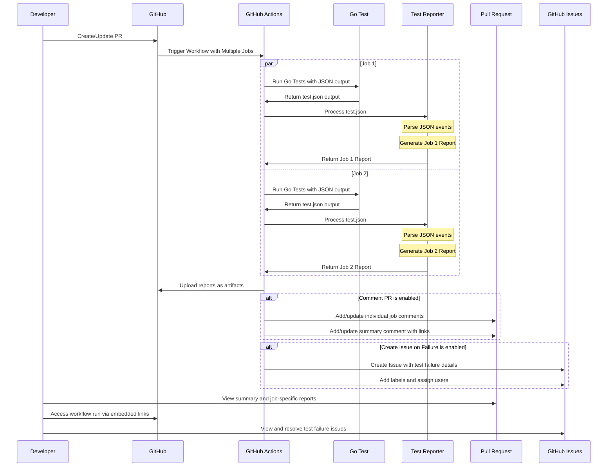

# Go Test Report Generator

A command-line tool and GitHub Action that generates beautiful Markdown reports from Go test output in JSON format.


[](https://opensource.org/licenses/MIT)

## Features

- **Reporting**
  - Beautiful Markdown reports from Go test JSON output
  - Hierarchical display of tests and subtests
  - Visual status indicators with badges and emojis (✅ PASS, ❌ FAIL, ⏭️ SKIP)
  - Test durations with visual bar charts
  - Collapsible sections for failed test details and metrics

- **Statistics**
  - Total, passed, failed, and skipped test counts
  - Success rate percentage
  - Total test duration

- **GitHub Integration**
  - Automated PR comments with test results
  - Multi-job support with consolidated reporting
  - Direct links to GitHub Actions workflow runs
  - Automatic issue creation for test failures

## Installation

### Option 1: GitHub Action

Add to your workflow file:

```yml
- name: Run Go tests with JSON output
  run: go test ./... -json > test-output.json || true

- name: Generate Test Report
  uses: dipjyotimetia/gotest-report@main
  with:
    test-json-file: test-output.json
    output-file: test-report.md
    comment-pr: true
```

### Option 2: Binary Installation

Download pre-compiled binaries:

```bash
# Linux/macOS
curl -L https://github.com/dipjyotimetia/gotest-report/releases/latest/download/gotest-report_<version>_<os>_<arch>.tar.gz | tar xz
sudo mv gotest-report /usr/local/bin/

# Windows
# Download the .zip file from the releases page and extract it
```

### Option 3: Go Install

```sh
go install github.com/dipjyotimetia/gotest-report@latest
```

### Option 4: Docker Container

```sh
# Pull the image
docker pull ghcr.io/dipjyotimetia/gotest-report:latest

# Process JSON file
docker run --rm -v $(pwd):/data ghcr.io/dipjyotimetia/gotest-report -input /data/test-output.json -output /data/test-report.md

# Or pipe directly
go test ./... -json | docker run --rm -i ghcr.io/dipjyotimetia/gotest-report > test-report.md
```

## Usage

### Command Line

```sh
# Pipe directly
go test ./... -json | gotest-report

# Save JSON and process
go test ./... -json > test-output.json
gotest-report -input test-output.json -output test-report.md
```

### Command Line Options

```
  -input string
        go test -json output file (default is stdin)
  -output string
        Output markdown file (default "test-report.md")
  -version
        Show version information
```

## GitHub Action Configuration

### Action Inputs

| Input | Description | Required | Default |
| ----- | ----------- | -------- | ------- |
| test-json-file | Path to the go test -json output file | No | test-output.json |
| output-file | Path for the generated Markdown report | No | test-report.md |
| comment-pr | Whether to comment the PR with the test report | No | true |
| job-name | Name of the job running the tests (for multi-job reports) | No | '' |
| summary-only | Include only summary in the combined PR comment (for multi-job setups) | No | false |
| write-summary | Whether to write the test report to GitHub Actions Summary | No | false |
| create-issue-on-failure | Whether to create a GitHub issue when tests fail | No | false |
| issue-title | Title for the GitHub issue to be created on test failure | No | 'Test Failure Report' |
| issue-labels | Comma-separated list of labels for the created issue | No | 'test-failure,bug' |
| issue-assignees | Comma-separated list of users to assign to the created issue | No | '' |

### Multi-Job Setup Example

Here's how to use the action in a multi-job workflow:

```yml
name: Go Tests

on:
  pull_request:
    branches: [ main ]

permissions:
  pull-requests: write
  contents: read

jobs:
  unit-tests:
    runs-on: ubuntu-latest
    steps:
    - uses: actions/checkout@v4
    - uses: actions/setup-go@v5
      with:
        go-version: '1.23'
        cache: false

    - name: Run unit tests with JSON output
      run: |
        go test ./... -tags=unit -json > test-output.json || true

    - name: Generate and Comment Unit Test Report
      uses: dipjyotimetia/gotest-report@main
      with:
        test-json-file: test-output.json
        job-name: "Unit Tests"
        summary-only: true
        comment-pr: true

  integration-tests:
    runs-on: ubuntu-latest
    steps:
    - uses: actions/checkout@v4
    - uses: actions/setup-go@v5
      with:
        go-version: '1.23'
        cache: false

    - name: Run integration tests with JSON output
      run: |
        go test ./... -tags=integration -json > test-output.json || true

    - name: Generate and Comment Integration Test Report
      uses: dipjyotimetia/gotest-report@main
      with:
        test-json-file: test-output.json
        job-name: "Integration Tests"
        summary-only: true
        comment-pr: true
```

### Automatic Issue Creation for Test Failures

You can configure the action to automatically create GitHub issues when tests fail:

```yml
- name: Generate Test Report
  uses: dipjyotimetia/gotest-report@main
  with:
    test-json-file: test-output.json
    output-file: test-report.md
    comment-pr: true
    create-issue-on-failure: true
    issue-title: "Test Failures in PR #${{ github.event.pull_request.number }}"
    issue-labels: "bug,test-failure,needs-investigation"
    issue-assignees: "${{ github.event.pull_request.user.login }}"
```

This will:
1. Create an issue only when tests fail
2. Include test failure details from the report
3. Link to the relevant PR and workflow run
4. Apply specified labels and assign to specified users

## Output Format

The generated Markdown report includes:

1. **Summary Section** - Overall test statistics
2. **Test Status** - Visual badge indicator of overall test status
3. **Test Results** - Table of all tests with status and duration
4. **Failed Tests Details** - Collapsible section with detailed output for failed tests (if any)
5. **Test Durations** - Collapsible section with bar chart visualization of the longest-running tests
6. **Workflow Link** - Direct link to the GitHub Actions workflow run
7. **Timestamp** - When the report was generated

## How It Works



## Example Output

### Summary Comment

<details>
<summary>Click to expand Summary Comment example</summary>

# Test Summary Report

## Summary

- **Total Tests:** 12
- **Passed:** 12 (100.0%)
- **Failed:** 0
- **Skipped:** 0
- **Total Duration:** 3.45s

## Test Status


<details>
<summary>View details for all test jobs</summary>

This is a combined report summary. See individual job comments for detailed reports or check the [workflow run](https://github.com/dipjyotimetia/gotest-report/actions/runs/123456789).
</details>

---

[View Workflow Run](https://github.com/dipjyotimetia/gotest-report/actions/runs/123456789)

</details>

### Individual Job Comment

<details>
<summary>Click to expand Individual Job Comment example</summary>

# Unit Tests Results

## Summary

- **Total Tests:** 5
- **Passed:** 5 (100.0%)
- **Failed:** 0
- **Skipped:** 0
- **Total Duration:** 1.23s

## Test Status


## Test Results

| Test | Status | Duration | Details |
| ---- | ------ | -------- | ------- |
| **TestOne** | ✅ PASS | 0.500s | - |
| **TestTwo** | ✅ PASS | 0.400s | <details><summary>2 subtests</summary><table><tr><th>Subtest</th><th>Status</th><th>Duration</th></tr><tr><td>SubTest1</td><td>✅ PASS</td><td>0.200s</td></tr><tr><td>SubTest2</td><td>✅ PASS</td><td>0.200s</td></tr></table></details> |
| **TestThree** | ✅ PASS | 0.334s | - |

---

Job: **Unit Tests** | [View Workflow Run](https://github.com/dipjyotimetia/gotest-report/actions/runs/123456789)

Report generated at: 2024-03-20T15:30:00Z

</details>

### Test Failure Issue

<details>
<summary>Click to expand Test Failure Issue example</summary>

## Test Failure Report

Test failures detected in workflow run: [View Workflow Run](https://github.com/dipjyotimetia/gotest-report/actions/runs/123456789)

### Test Report

| Test | Status | Duration | Details |
| ---- | ------ | -------- | ------- |
| **TestAuth** | ✅ PASS | 0.300s | - |
| **TestLogin** | ❌ FAIL | 0.502s | - |
| **TestValidation** | ✅ PASS | 0.125s | - |

### Related Pull Request

This failure occurred in [PR #42](https://github.com/dipjyotimetia/gotest-report/pull/42)

_This issue was automatically created by the test workflow._
</details>

## License

MIT License
